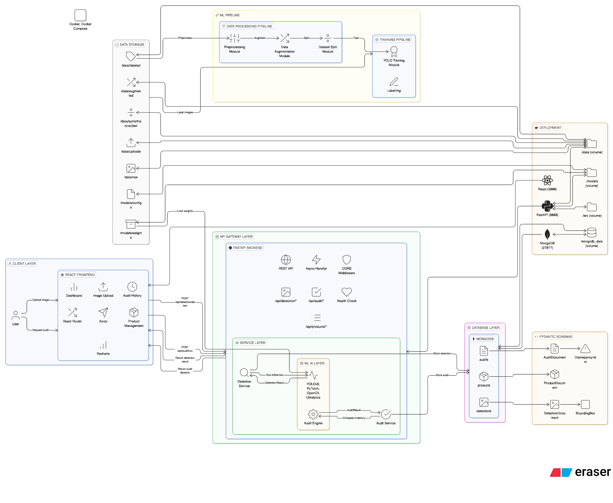

# Image-Based Product Recognition and Automated Audit Decision System

<p align="center">
  
</p>

<p align="center">
  <strong>Bachelor's Thesis Project</strong><br>
  National University of Mongolia<br>
  School of Information Technology and Electronics
</p>

<p align="center">
  <a href="#overview">Overview</a> •
  <a href="#features">Features</a> •
  <a href="#architecture">Architecture</a> •
  <a href="#tech-stack">Tech Stack</a> •
  <a href="#installation">Installation</a> •
  <a href="#usage">Usage</a> •
  <a href="#dataset">Dataset</a> •
  <a href="#results">Results</a>
</p>

---

## Overview

This project presents an **intelligent retail inventory audit system** that automates the traditionally manual process of shelf product verification. Using **computer vision** and **deep learning**, the system captures images of store shelves, detects products using **YOLOv8** object detection, compares findings against expected inventory, and generates automated audit decisions.

### Problem Statement

Retail inventory auditing is a critical but labor-intensive process. Traditional methods require auditors to manually count and verify products on store shelves, leading to:

- **Human error** in counting and identification
- **Time-consuming** manual verification processes
- **Inconsistent** audit quality across different auditors
- **Delayed** reporting and decision-making

### Solution

Our system addresses these challenges by providing:

- **Automated product detection** using trained YOLOv8 models
- **Real-time audit decisions** (PASS / WARNING / FAIL)
- **Mobile-first approach** for field auditors
- **Centralized dashboard** for managers and administrators
- **Historical tracking** and analytics

---

## Features

### Mobile Application (Flutter)
- Camera integration for shelf image capture
- Real-time product detection results
- Audit history and statistics
- Offline-capable design
- GPS location tagging

### Backend API (FastAPI)
- RESTful API with JWT authentication
- Async MongoDB operations
- Image processing pipeline
- Audit decision engine
- Campaign and survey management

### Web Dashboard (React)
- Real-time audit monitoring
- Campaign management
- Auditor assignment
- Survey builder with drag-and-drop
- Analytics and reporting

### ML Pipeline (YOLOv8)
- Custom-trained object detection model
- 4 product classes (extensible)
- Data augmentation pipeline
- Model evaluation and testing tools

---

## Architecture

```
┌─────────────────────────────────────────────────────────────────────────────┐
│                              SYSTEM ARCHITECTURE                             │
└─────────────────────────────────────────────────────────────────────────────┘

    ┌──────────────┐         ┌──────────────┐         ┌──────────────┐
    │   Flutter    │         │    React     │         │   YOLOv8     │
    │  Mobile App  │         │  Dashboard   │         │   Model      │
    │              │         │              │         │              │
    │  - Camera    │         │  - Campaigns │         │  - Training  │
    │  - Surveys   │         │  - Auditors  │         │  - Inference │
    │  - History   │         │  - Analytics │         │  - Export    │
    └──────┬───────┘         └──────┬───────┘         └──────┬───────┘
           │                        │                        │
           │         HTTP/REST      │                        │
           └────────────┬───────────┘                        │
                        │                                    │
                        ▼                                    │
           ┌────────────────────────┐                        │
           │      FastAPI Backend   │◄───────────────────────┘
           │                        │
           │  ┌──────────────────┐  │
           │  │  Authentication  │  │
           │  │      (JWT)       │  │
           │  └──────────────────┘  │
           │                        │
           │  ┌──────────────────┐  │
           │  │ Detection Service│  │──── ProductDetector (YOLO)
           │  └──────────────────┘  │
           │                        │
           │  ┌──────────────────┐  │
           │  │  Audit Engine    │  │──── Decision Logic (PASS/WARN/FAIL)
           │  └──────────────────┘  │
           │                        │
           └───────────┬────────────┘
                       │
                       ▼
           ┌────────────────────────┐
           │       MongoDB          │
           │                        │
           │  • audits              │
           │  • detections          │
           │  • products            │
           │  • campaigns           │
           │  • auditors            │
           │  • tradeshops          │
           └────────────────────────┘
```

---

## Tech Stack

| Component | Technology | Version |
|-----------|------------|---------|
| **Mobile App** | Flutter | 3.x |
| **Web Dashboard** | React.js | 18.3 |
| **Backend API** | FastAPI | 0.115 |
| **Database** | MongoDB | 7.0 |
| **ML Framework** | Ultralytics YOLOv8 | 8.3 |
| **Deep Learning** | PyTorch | 2.9 |
| **Computer Vision** | OpenCV | 4.12 |
| **Authentication** | JWT (PyJWT) | - |
| **Containerization** | Docker Compose | 3.8 |

---

## Installation

### Prerequisites

- Python 3.10+
- Node.js 18+
- Flutter SDK 3.x
- MongoDB 7.0+
- Docker & Docker Compose (optional)

### Backend Setup

```bash
# Clone repository
git clone https://github.com/AnarTHEmegamind0/Diploma-monorepo.git
cd Diploma-monorepo

# Create virtual environment
python -m venv venv
source venv/bin/activate  # Windows: venv\Scripts\activate

# Install dependencies
pip install -r requirements.txt

# Configure environment
cp .env.example .env
# Edit .env with your settings

# Start MongoDB
docker-compose up mongodb -d

# Run backend
uvicorn backend.app.main:app --reload --port 8000
```

### Frontend Setup

```bash
cd frontend

# Install dependencies
npm install

# Start development server
npm start
```

### Mobile App Setup

```bash
cd application

# Get dependencies
flutter pub get

# Run app
flutter run
```

### Docker (Full Stack)

```bash
docker-compose up --build
```

---

## Usage

### 1. Login to Dashboard

Access `http://localhost:3000` and login with admin credentials.

### 2. Create Campaign

- Navigate to Campaigns
- Create new audit campaign
- Assign auditors and tradeshops

### 3. Mobile Audit Flow

1. Auditor logs in to mobile app
2. Selects assigned campaign
3. Visits tradeshop location
4. Captures shelf images
5. System detects products automatically
6. Completes survey questions
7. Submits audit

### 4. View Results

- Real-time results appear on dashboard
- Audit status: PASS / WARNING / FAIL
- View detection details and discrepancies

---

## Dataset

### Product Classes

| ID | Class Name | Description |
|----|------------|-------------|
| 0 | bonaqua_500ml | Bonaqua mineral water 500ml |
| 1 | coca_cola_500ml | Coca-Cola 500ml bottle |
| 2 | fanta_500ml | Fanta (all flavors) 500ml |
| 3 | sprite_500ml | Sprite 500ml bottle |

### Dataset Statistics

| Metric | Value |
|--------|-------|
| Total Images | 96 |
| Total Annotations | 684 |
| Training Set | 67 images (70%) |
| Validation Set | 19 images (20%) |
| Test Set | 10 images (10%) |
| Annotation Method | Roboflow SAM3 Auto-labeling |
| Label Format | YOLO Bounding Box |

### Dataset Structure

```
data/
├── splits/
│   ├── train/
│   │   ├── images/     # 67 training images
│   │   └── labels/     # YOLO format labels
│   ├── val/
│   │   ├── images/     # 19 validation images
│   │   └── labels/
│   └── test/
│       ├── images/     # 10 test images
│       └── labels/
└── raw/                # Original 96 images
```

---

## Results

### Model Performance (Expected)

| Metric | Value |
|--------|-------|
| mAP@50 | ~0.70+ |
| Precision | ~0.75+ |
| Recall | ~0.70+ |
| Inference Time | <100ms |

### Audit Decision Logic

| Condition | Status |
|-----------|--------|
| Difference ≤ 10% | **PASS** |
| 10% < Difference ≤ 30% | **WARNING** |
| Difference > 30% | **FAIL** |
| Missing expected product | **FAIL** |
| Unexpected extra product | **WARNING** |

---

## API Reference

### Authentication

```http
POST /api/auth/login
Content-Type: application/json

{
  "phone": "88001122",
  "password": "audit123"
}
```

### Detection

```http
POST /api/detection/detect
Content-Type: multipart/form-data

file: <image>
```

### Audit

```http
POST /api/audit/run
Content-Type: application/json

{
  "expected_inventory": {...},
  "detected_products": {...}
}
```

### Full API Documentation

Start the backend and visit: `http://localhost:8000/docs`

---

## Project Structure

```
Diploma-monorepo/
├── application/           # Flutter mobile app
│   ├── lib/
│   │   ├── screens/       # UI screens
│   │   ├── services/      # API services
│   │   ├── providers/     # State management
│   │   └── models/        # Data models
│   └── pubspec.yaml
│
├── backend/               # FastAPI backend
│   └── app/
│       ├── main.py        # App entry point
│       ├── config.py      # Configuration
│       ├── database.py    # MongoDB connection
│       ├── models/        # Pydantic schemas
│       ├── routes/        # API endpoints
│       └── services/      # Business logic
│
├── frontend/              # React dashboard
│   └── src/
│       ├── pages/         # Page components
│       ├── components/    # Reusable components
│       ├── services/      # API client
│       └── context/       # State context
│
├── src/                   # ML pipeline
│   ├── data/              # Data processing
│   ├── training/          # Model training
│   ├── inference/         # Detection & Audit
│   └── utils/             # Utilities
│
├── data/                  # Dataset
│   ├── raw/               # Original images
│   └── splits/            # Train/Val/Test
│
├── models/                # Model files
│   ├── configs/           # dataset.yaml
│   └── weights/           # Trained weights
│
├── latex/                 # Thesis document
├── scripts/               # Utility scripts
├── tests/                 # Unit tests
│
├── docker-compose.yml     # Docker configuration
├── requirements.txt       # Python dependencies
└── README.md
```

---

## Training the Model

### On Windows with RTX 3070

```bash
# Activate environment
venv\Scripts\activate

# Run training script
python scripts/train_rtx3070.py --epochs 100 --batch 16

# Evaluate model
python scripts/test_model.py --evaluate
```

### Training Configuration

- **Base Model:** YOLOv8n (nano)
- **Epochs:** 100
- **Image Size:** 640x640
- **Batch Size:** 16
- **Optimizer:** SGD

---

## Contributing

This is a bachelor's thesis project. For questions or suggestions:

1. Open an issue
2. Fork and submit PR
3. Contact the author

---

## License

This project is developed for educational purposes as part of a bachelor's thesis at NUM.

---

## Author

**Tuvshinjargal Anar**

- University: National University of Mongolia (NUM)
- Department: School of Information Technology and Electronics
- Year: 2025-2026

---

## Acknowledgments

- **Thesis Advisor:** Javkhlan Rentsendorj
- **Roboflow** for dataset annotation tools
- **Ultralytics** for YOLOv8 framework
- **FastAPI** community for excellent documentation

---

<p align="center">
  <sub>Built with dedication for the future of retail automation</sub>
</p>
